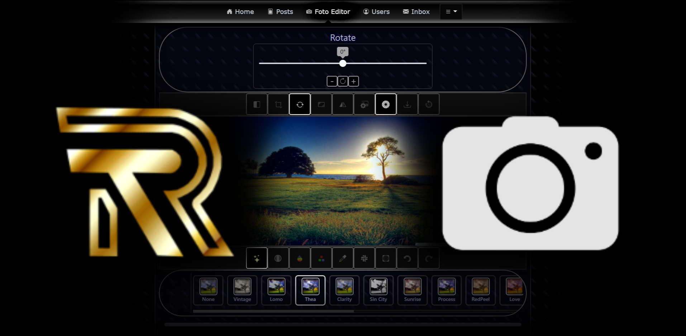

# RTFotoEditor    
Student Web Application Project created by Marko Rezić and Toni Jelonjić, Faculty of Mechanical Engineering, Computer Science and Electrical Engineering in Mostar, Bosnia and Herzegovina.

## Homepage
The website can be found at our [Homepage](https://studenti.sum.ba/projekti/fsre_rwa/2020/g4/), hosted by SUMARUM.

## Service
Our web application provides users with a photo editor for quick and easy editing of images.
The image can be downloaded locally or, if a user is verified, uploaded to the website.
Uploaded images can be viewed in the Posts tab.

Users also have access to a personal Inbox where they can exchange messages, and a Profile page where they can add a profile image.

## Frameworks
* Frontend: React v17.0.1
* Backend: ExpressJS v4.17.1
* CSS Style: Bootstrap v4.5.3
* Database: MySQL Community Server v8.0.23, database provided by SUMARUM
* Editor: CamanJS v4.1.2, open-source library, GitHub Repository: [CamanJS](https://github.com/meltingice/CamanJS)
